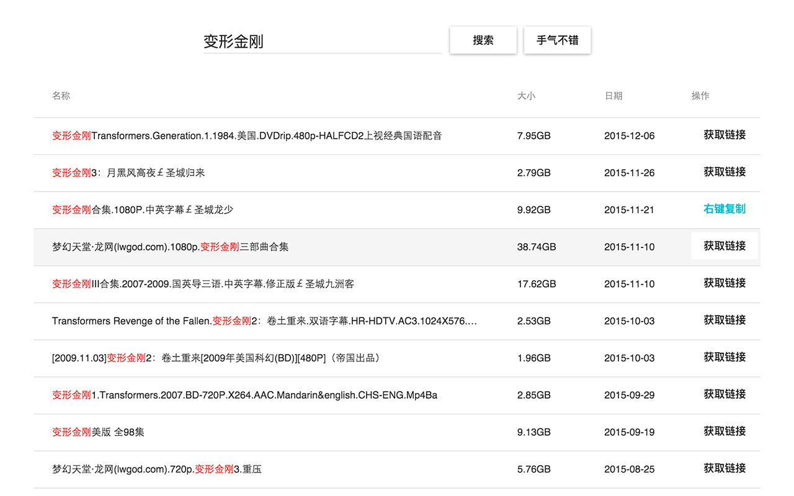

# btmagd

更方便地使用bt搜索资源

## 使用须知

由于国内网络环境限制（你懂得），**请先确认能在浏览器中正常打开[http://www.btaia.com](http://www.btaia.com)再使用本插件**，如不能，请添加相应的代理规则

## 改进

* 无广告
* 更快的搜索速度
* 支持右键菜单关键字搜索
* 更快地获取下载链接

## 安装

### 方式1

[Chrome网上应用店](https://chrome.google.com/webstore/detail/bt2mag/mbkbpijebbclkfpgghmklejihnpmdphf)

### 方式2

1. 前往[此页面](https://github.com/chshouyu/btmagd/releases)下载最新的zip安装包，解压得到.crx文件
2. 在Chrome浏览器中打开 菜单 -> 更多工具 -> 扩展程序 页面
3. 将.crx文件拖拽到页面，确认安装即可使用

## 预览

-------

